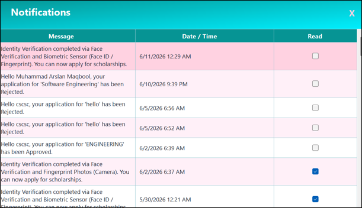

# QuasarEdu — Scholarship Management System

> A comprehensive, multi-tier scholarship management platform that digitizes the end-to-end lifecycle of student scholarship applications — from registration and eligibility matching to biometric identity verification and AI-powered document extraction.

---

## Table of Contents

- [Overview](#overview)
- [Features](#features)
- [Tech Stack](#tech-stack)
- [Architecture](#architecture)
- [Project Structure](#project-structure)
- [Database](#database)
- [Setup & Installation](#setup--installation)
- [Configuration](#configuration)
- [Security](#security)
- [API Reference](#api-reference)
- [UI Walkthrough](#ui-walkthrough)
- [User Manual](#user-manual)

---

## Overview

QuasarEdu is a dual-platform scholarship management system built with a **Windows Forms desktop client** (C# / .NET 10) and a companion **ASP.NET Core Web API** (.NET 8). It replaces manual, error-prone scholarship processes with an automated, fraud-resistant workflow covering:

- Student self-registration and profile building
- Smart, eligibility-based scholarship discovery
- Document upload and management
- Mobile-based biometric identity verification (face selfie + fingerprint / Face ID / PIN)
- Admin review, approval/rejection, and notification dispatch
- AI-powered document scanning with auto-fill (Google Gemini Vision)
- PDF receipt generation with QR code verification

---

## Features

### Student-Facing
- Secure registration with email OTP verification
- Comprehensive profile builder (personal, academic, financial, biometric data)
- Smart scholarship discovery — only eligible scholarships are shown, color-coded by match strength
- One-click scholarship application with optional personal statement
- Document upload with type-based validation (`.pdf`, `.jpg`, `.jpeg`, `.png`)
- Mobile-based identity verification (face selfie + fingerprint photo / biometric sensor / PIN)
- Real-time application status tracking (Pending / Withdrawn / Approved / Rejected)
- Withdraw and reapply for rejected or withdrawn applications
- In-app notification inbox with unread badge
- Printable PDF application receipt with embedded QR code
- **AI Auto Fill** — upload a CNIC, SSC/HSSC certificate, domicile, or income document and Gemini Vision extracts and fills matching profile fields automatically (empty fields only)
- **QuasarEdu Assistant** — floating AI chatbot strictly scoped to scholarship topics, supports Urdu queries

### Administrator-Facing
- Full scholarship CRUD (create, read, update, deactivate)
- KPI dashboard: total scholarships, total applications, pending reviews, approval rate
- Live pie chart of application status distribution
- Application review queue — approve or reject with optional comments
- Automated email notifications to students on status changes
- Filterable student list with full profile popup
- Centralized document viewer and printer
- PDF receipt generation with QR code for any application
- System-wide notification broadcasting

### System & Security
- Role-based access control (Student / Admin)
- Brute-force login protection (5 attempts → 15-minute lockout)
- BCrypt password hashing
- SQL injection prevention via parameterized queries throughout
- Concurrency-safe approval flow (`WHERE Status = 'Pending'` guard)
- Email OTP for account verification and password reset
- Tamper-resistant, token-based verification links (1-hour TTL, single-use, atomic claim)
- Transaction-wrapped database writes with rollback on failure
- Cloudflare Tunnel integration for secure local-to-internet API exposure

---

## Tech Stack

| Layer | Technology |
|---|---|
| Desktop Client | C# Windows Forms (.NET 10) |
| Web API | ASP.NET Core Minimal API (.NET 8) |
| Database | Microsoft SQL Server (database: `ft`) |
| Data Access | `Microsoft.Data.SqlClient` + raw SQL / stored procedures |
| Tunnel | Cloudflare Tunnel (`cloudflared`) |
| Email (SMTP) | `System.Net.Mail` via Gmail SMTP |
| UI Component Library | Guna.UI2.WinForms v2.0.4.7 |
| Charts | Guna.Charts.WinForms v1.1.0 |
| Password Hashing | BCrypt.Net-Next v4.2.0 |
| PDF Generation | QuestPDF v2026.5.0 |
| QR Code | QRCoder v1.4.3 |
| AI / OCR | Google Gemini 2.5 Flash Lite (REST API) |
| PDF-to-Image | PDFtoImage + SkiaSharp |
| IDE | Visual Studio 2022 |
| Version Control | Git |

---

## Architecture

```
┌─────────────────────────────────────────────────┐
│           Windows Forms Desktop Client           │
│  (Students & Admins — C# / .NET 10)             │
│                                                  │
│  Models → Repositories → Services → Forms       │
└────────────────────┬────────────────────────────┘
                     │ ADO.NET (SqlClient)
                     ▼
          ┌──────────────────────┐
          │  Microsoft SQL Server │
          │  (database: ft)       │
          │  ~60 Stored Procs    │
          └──────────────────────┘

┌─────────────────────────────────────────────────┐
│       ASP.NET Core Minimal API (.NET 8)          │
│  Identity & Fingerprint Verification Endpoint    │
│  Exposed via Cloudflare Tunnel (HTTPS)           │
└─────────────────────────────────────────────────┘
          ▲
          │ HTTPS (from student's smartphone browser)
          │
   Mobile Web Verification Page
   (Face selfie + Fingerprint / Biometric / PIN)
```

---

## Project Structure

```
QuasarEdu/
├── WindowsForms/               # Main desktop application
│   ├── Models/                 # Entity classes (User, Student, Scholarship, etc.)
│   ├── Repositories/           # Data access layer (UserRepo, StudentRepo, etc.)
│   ├── Services/               # Business logic (Receipt, Document, Gemini, etc.)
│   └── Forms/                  # All WinForms UI (19 forms)
│
├── API/                        # ASP.NET Core Minimal API
│   └── Program.cs              # All endpoints and record types in single file
│
├── Cloudflare/                 # Cloudflare Tunnel binary & config
│
├── Database QuasarEdu.sql      # Full database schema + all stored procedures
└── QuasarEdu — User Manual.pdf # Setup and usage guide
```

---

## Database

The system uses **10 entities** across a fully normalized (3NF) SQL Server schema:

| Table | Purpose |
|---|---|
| `Users` | Authentication credentials and role |
| `Students` | Extended student profile (academic, financial, biometric) |
| `Scholarships` | Scholarship listings with eligibility rules |
| `Applications` | Student applications with status tracking |
| `Documents` | Metadata for all uploaded files |
| `ApplicationDocuments` | Point-in-time document snapshot per application |
| `Notifications` | In-app messages for students |
| `SavedScholarships` | Bookmarked scholarships |
| `FingerprintVerificationTokens` | Single-use tokens for post-approval fingerprint verification |
| `IdentityVerificationTokens` | Single-use tokens for initial identity verification |

The schema includes ~60 stored procedures and one view (`vw_FingerprintStatus`). Import the full schema using `Database QuasarEdu.sql`.

---

## Setup & Installation

### Prerequisites

- Windows 10/11
- [.NET 10 SDK](https://dotnet.microsoft.com/download) (for Windows Forms client)
- [.NET 8 SDK](https://dotnet.microsoft.com/download) (for the API)
- Microsoft SQL Server (Express or higher)
- Visual Studio 2022
- A Gmail account with an App Password enabled (for SMTP)
- A [Google Gemini API key](https://aistudio.google.com/) (for AI features)
- [cloudflared](https://developers.cloudflare.com/cloudflare-one/connections/connect-networks/downloads/) binary (included in `/Cloudflare`)

### Steps

1. **Clone the repository**
   ```bash
   git clone https://github.com/MahadNisarKhan/QuasarEdu.git
   cd QuasarEdu
   ```

2. **Create the database**

   Open SQL Server Management Studio and run `Database QuasarEdu.sql` against your SQL Server instance. This creates the `ft` database with all tables, stored procedures, indexes, and the `vw_FingerprintStatus` view.

3. **Configure the Windows Forms app**

   In `WindowsForms/`, open `Database.cs` and update the connection string:
   ```csharp
   public const string ConnectionString =
       "Server=YOUR_SERVER;Database=ft;Integrated Security=True;";
   ```

   In `Utils.cs`, set your Gmail SMTP credentials and Gemini API key:
   ```csharp
   public static string GeminiApiKey = "YOUR_GEMINI_KEY";
   public static string SmtpEmail    = "your@gmail.com";
   public static string SmtpPassword = "your_app_password";
   ```

4. **Start the Cloudflare Tunnel**

   ```bash
   cd Cloudflare
   cloudflared tunnel --url http://localhost:5000
   ```
   Copy the generated `https://xxxx.trycloudflare.com` URL.

5. **Set the tunnel URL in the desktop app**

   In `Utils.cs`:
   ```csharp
   public static string FingerprintServerBaseUrl = "https://xxxx.trycloudflare.com";
   ```

6. **Run the API**

   ```bash
   cd API
   dotnet run
   ```

7. **Run the Windows Forms app**

   Open `WindowsForms/QuasarEdu.sln` in Visual Studio 2022 and press **F5**.

> For detailed step-by-step instructions, refer to **QuasarEdu — User Manual.pdf** included in the repository.

---

## Configuration

| Setting | Location | Description |
|---|---|---|
| SQL connection string | `Database.cs` → `ConnectionString` | Points to local SQL Server, database `ft` |
| Gmail SMTP credentials | `Utils.cs` | Used for OTP, verification, and notification emails |
| Gemini API key | `Utils.cs` → `GeminiApiKey` | Powers AI Auto Fill and the chatbot |
| Cloudflare tunnel URL | `Utils.cs` → `FingerprintServerBaseUrl` | Public HTTPS URL for the identity verification API |
| Upload directory | API `Program.cs` | Files saved to `C:\ScholarshipApp\Uploads` by default |

---

## Security

| Feature | Detail |
|---|---|
| Brute-force protection | 5 failed login attempts → 15-minute in-memory lockout (admin-exempt) |
| OTP expiry | 5-minute window, max 3 attempts |
| Password hashing | BCrypt.Net-Next with plain-text migration fallback |
| SQL injection prevention | `SqlParameter` used throughout — no string concatenation in queries |
| Verification tokens | 64-char random hex, 1-hour TTL, single-use (atomic `UPDATE IsUsed = 1 WHERE IsUsed = 0`) |
| Concurrency safety | Approve/reject guard: `WHERE Status = 'Pending'` prevents double-processing |
| Transaction safety | Application submission and review wrapped in `SqlTransaction` with full rollback |
| File upload whitelist | Only `.pdf`, `.jpg`, `.jpeg`, `.png` accepted |
| Session validation | Every dashboard checks `Session.UserEmail` on load; null → redirects to Login |
| AI scope isolation | Gemini uses `temperature: 0.1` for extraction; chatbot hard-limited to QuasarEdu topics only |

---

## API Reference

| Method | Route | Description |
|---|---|---|
| `GET` | `/verify?token=…` | Validates scholarship fingerprint token; serves verification page |
| `GET` | `/api/token-info?token=…` | Returns token validity, student name, scholarship title |
| `POST` | `/api/verify-complete` | Marks token used; updates `FingerprintVerified`; inserts notification |
| `GET` | `/identity-verify?token=…` | Validates identity token; serves identity verification page |
| `GET` | `/api/identity-token-info?token=…` | Returns identity token validity and student name |
| `POST` | `/api/identity-verify-complete` | Saves face selfie + biometric/fingerprint data; marks token used; updates `FingerprintTemplate`; sends confirmation email |

### Request Body — `POST /api/identity-verify-complete`

```json
{
  "token": "string",
  "captureMethod": "fingerprint_photo | biometric | pin_code",
  "faceImageBase64": "string (always present)",
  "fingerCaptures": {
    "right_thumb": "base64",
    "right_4fingers": "base64",
    "left_thumb": "base64",
    "left_4fingers": "base64"
  },
  "biometricCredential": "string (WebAuthn / Face ID)",
  "imageBase64": "string (fallback single image)"
}
```

---

## UI Walkthrough

### Form 1 — Loading Screen
Animated splash screen displayed while the application initialises. A progress bar advances from 0–100% before transitioning to the Login form.


---

### Form 2 — Login
Authenticates an existing user and routes them to the correct dashboard based on their role (Student / Admin). Includes brute-force lockout after 5 failed attempts.


---

### Form 3 — Register
Creates a new student account. On submit, a 6-digit OTP is sent to the provided email and the OTP Verification form opens automatically.


---

### Form 4 — OTP Verification
Verifies that the email address belongs to the registrant. Six individual digit boxes auto-advance focus. A 5-minute countdown is shown; OTP can be resent if it expires.


---

### Form 5 — Student Dashboard
Central hub for student navigation. Displays a welcome banner with identity verification status, four stat tiles (total scholarships, applications submitted, approved, pending), and a live list of top eligible scholarships with Apply and Save buttons.


---

### Form 6 — Student Profile
Multi-tab form for students to fill in all personal, academic, and financial data required for eligibility evaluation. Includes an **Auto Fill** button that uses Google Gemini Vision to extract fields from uploaded documents, and a **Verify Identity** button that sends a mobile verification link.


---

### Form 7 — Apply for Scholarship
Lets an eligible student submit an application for a specific scholarship. Shows read-only scholarship details, an optional personal statement field, a required document checklist, and the Submit Application button which calls `sp_SubmitApplication`.


---

### Form 8 — My Applications
Displays all past and current applications of the logged-in student. Status is colour-coded (green = Approved, red = Rejected, amber = Pending). Supports withdraw, reapply, and PDF receipt download actions.


---

### Form 9 — Admin Dashboard
Complete operational overview for administrators. Four live KPI tiles, a scholarships management tab, an applications review tab, a students list tab, a documents tab, and a notifications broadcast panel.


---

### Form 11 — Add / Edit Scholarship
Create or modify a scholarship record. Fields include title, description, eligibility text, amount (PKR), deadline, minimum CGPA, maximum family income, degree program, semester/year, need-based flag, required documents, and active status.


---

### Form 12 — Notifications
Student notification inbox. Unread notifications are highlighted in light blue; read ones appear in white. A "Mark All Read" button sets all unread entries to read in one click.



---

### Form 13 — Document Upload / Viewer
Upload and review documents associated with scholarship applications. Supports image preview for JPG/PNG and shows file name for PDFs. A grid lists all previously uploaded documents with type and upload date.


---

### Form 14 — Forgot Password
Password reset via email OTP. The email field is locked after OTP dispatch to prevent email-swap attacks. New password must be at least 6 characters; BCrypt-hashed before storage.


---

### Form 15 — Student List (Admin)
Searchable, filterable list of all registered students. Admins can filter by name, CNIC, department, degree program, max family income, and minimum CGPA. Double-clicking a row opens the Student Profile Popup.


---

### Form 16 — Student Profile Popup (Admin)
Read-only field-value grid displaying a student's complete profile in a modal dialog. Derives an identity verification status row from the `FingerprintTemplate` field and renders all dates in `dd MMM yyyy` format.


---

### Form 17 — All Documents (Admin)
View, open, and print all uploaded documents across all students. Available in both global admin mode (all students) and per-student mode. Each row shows student email, document type, file name, and upload date.


---

### Form 18 — Toast Notifications
Non-blocking, auto-dismissing overlay notifications in four severity variants: Success (emerald), Error (red), Info (blue), and Warning (amber). Toasts stack top-right and auto-close after 3–4 seconds.


---

### Form 19 — QuasarEdu Assistant (Chatbot)
Always-available floating AI chatbot powered by Google Gemini. Strictly limited to QuasarEdu scholarship topics — off-topic queries receive a fixed redirect message. Supports Urdu. Retains the last 20 conversation turns per session.


---

## User Manual

A full user manual covering installation, configuration, and usage for both students and administrators is included in the repository:

📄 [`QuasarEdu — User Manual.pdf`](./QuasarEdu%20%E2%80%94%20User%20Manual.pdf)

---

*© 2026 Project QuasarX | QuasarEdu. All rights reserved.*
